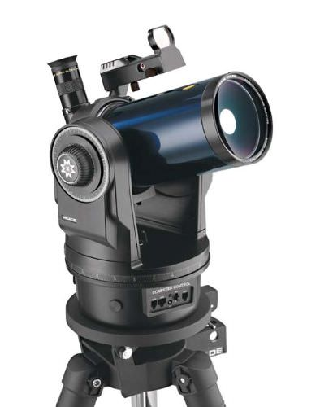
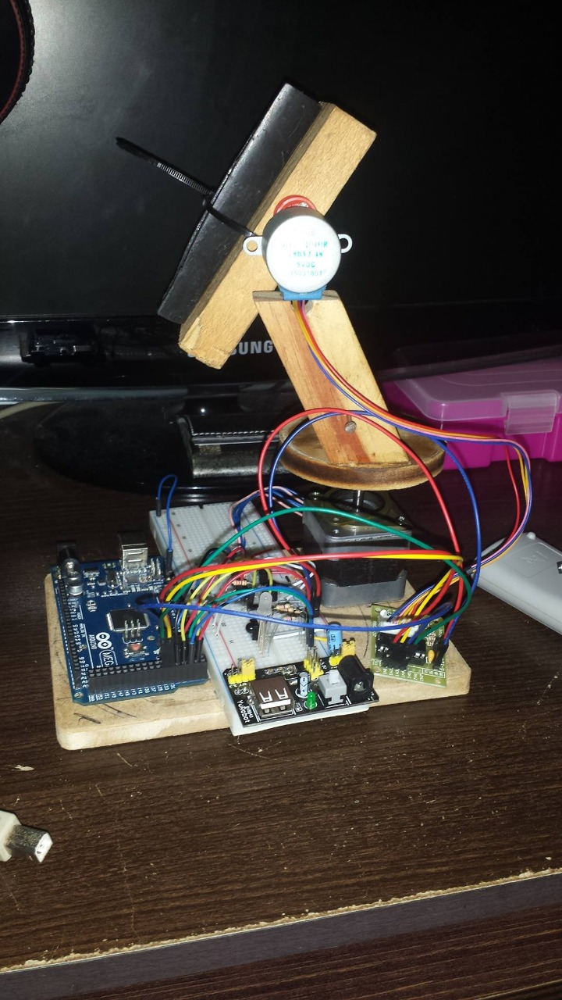
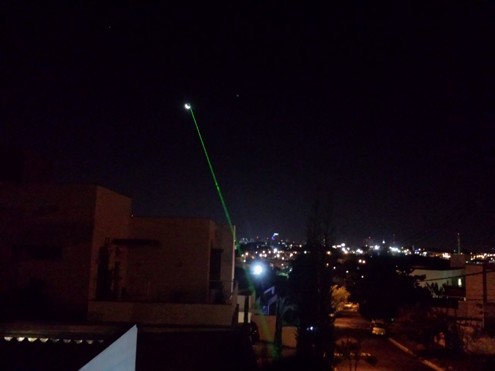

# Quem sou?
[Clique aqui](https://github.com/urbanze) para acessar meu perfil do GitHub. Informações de contato também estão presentes no perfil, caso queira conversar comigo, o Telegram é o jeito mais fácil e rápido =).

# O que é este site?
Este site conterá o detalhamento do desenvolvimento de alguns projetos pessoais, onde pretendo demonstrar o desenvolvimento, os problemas, as soluções, os erros e tudo que está envolvido ao desenvolver um projeto. A ideia é quase como um diário, onde estará relatado a evolução dos projetos ao longo do tempo, podendo ser útil para mais pessoas que queiram montar projetos similares.

Os projetos são apenas um desenvolvimento e desafio pessoal para melhorar minhas habilidades e fermentar meus hobbys. Todos projetos naturalmente conterão erros e muitos aspectos para melhorias, onde qualquer boa sugestão é sempre bem-vinda. DIY é o foco.

# GoTo Telescope

## O que é?
Um GoTo Telescope é basicamente um telescópio automatizado que podemos colocar as coordenadas dos objetos celestes (estrelas, planetas, etc) para que o software, motores e afins apontem ao objeto desejado. Também é comum que esses sistemas façam tracking (acompanham) do objeto em tempo real.

## Ideia inicial (12/2016)
A ideia de fazer esse projeto iniciou-se no fim do primeiro ano (2016) da minha faculdade, onde eu havia comprado um ESP8266-01 e estava procurando alguma coisa para automatizar, onde acabei olhando meu telescópio (Celestron 70mm Travel Scope) e decidi juntar as ideias sem mesmo saber que isso (GoTo Telescope) já existia e havias projetos difundidos pela internet.

## Controle
Desde bem pequeno, sempre utilizei o software Stellarium para visualizar o céu e acabei pensando em utilizar as coordenadas que aparecem na tela para indicar ao software de controle dos motores onde deve ser apontado. Após algumas pesquisas iniciais, descobri que o Stellarium havia um plugin para controle de telescópio e decidi estudar sobre o funcionamento e como seria essa comunicação com o telescópio utilizando o protocolo padrão "LX200".

### Primeiro protótipo alpha (01/2017)
Após semanas estudando o protocolo LX200 e como funcionaria para enviar os dados ao ESP8266 (via TCP e/ou Serial), iniciei os testes utilizando um Arduino Mega para converter as coordenadas enviadas pelo Stellarium para um único motor de passo do eixo X (Az). As fórmulas necessárias para toda conversão das coordenadas em formato RA/DEC para Alt/Az foram um verdadeiro desáfio complexo de ser vencido onde continuei com algumas partes sem solução, como o cálculo da hora ângulo baseado em minha coordenada: Local Sideral Time (LST). Com essa pedra no caminho, acabava colocando alguns valores fixos no código apenas para que as contas pudessem ser terminadas.

[Clique aqui](/videos/telescope_09012017.mp4) para visualizar o video do primeiro protótipo.

### Segundo protótipo alpha (02/2017)
Após um mês de desenvolvimento e melhorias, foi adicionado o motor do eixo Y (Alt) além de melhoria nas contas mas ainda sem sucesso em 100% das fórmulas, utilizando alguns valores fixos como a hora angulo para LST. A partir deste ponto, comecei a utilizar um laser verde de 1W bastante comum em astronomia no lugar do telescópio em si, pois é mais fácil para criar uma mecânica simples já que eu não tinha como criar sistemas grandes e robustos em casa.

### Terceiro protótipo alpha (07/2017)
Algums meses se passaram e com ajuda de um vizinho/amigo (Vitor) e sua CNC de corte a laser, consegui montar um prototipo de MDF mais digno de ser apresentado e funcional, com uma caixa nova, engrenagens e até uma pequena PCB com o circuito já adicionado ao ESP8266. Nestes meses também foi desenvolvido um software em C# para controle do telescópio pelo computador via TCP com o ESP8266. Este software permitia todos controles manuais e ainda havia a entrada para a variável da hora ângulo que até então ainda não consegui efetuar o cálculo dessa informação.

Este terceiro protótipo já conseguia fazer todas operações básicas da ideia inicial do projeto, mesmo que de forma relativamente precária. As engrenagens haviam bastante jogo (backlash, etc), os motores haviam pouquissima precisão e torque, já que eram pequenos, com pouca redução apenas para validar a ideia com o laser. O protótipo se mostrou funcional e conseguia mirar o laser para os objetos de forma visualmente satisfatória.

\
[Clique aqui](https://github.com/urbanze/urbanze.github.io/tree/main/videos/telescope_13072017.mp4) para visualizar o video do terceiro protótipo.
