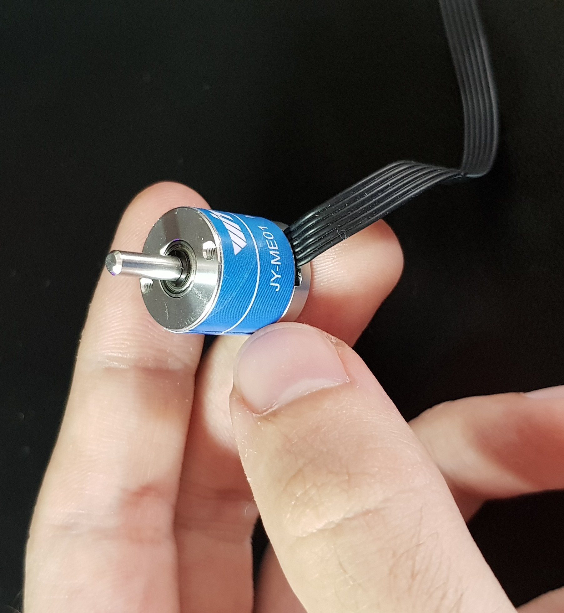
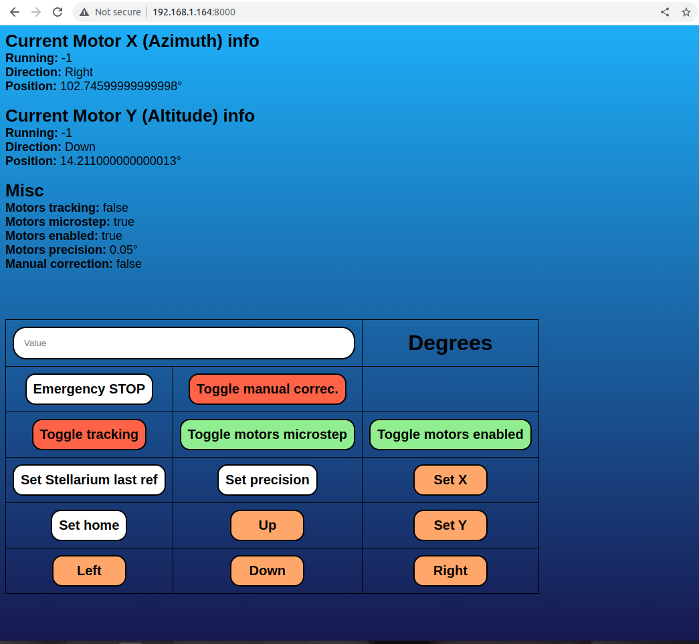
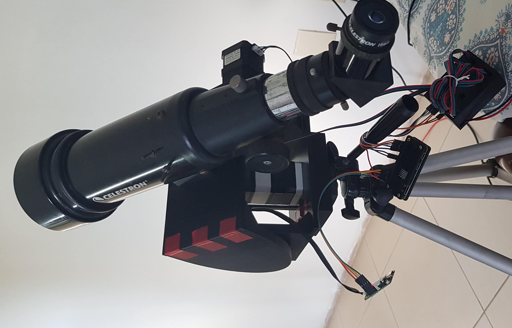
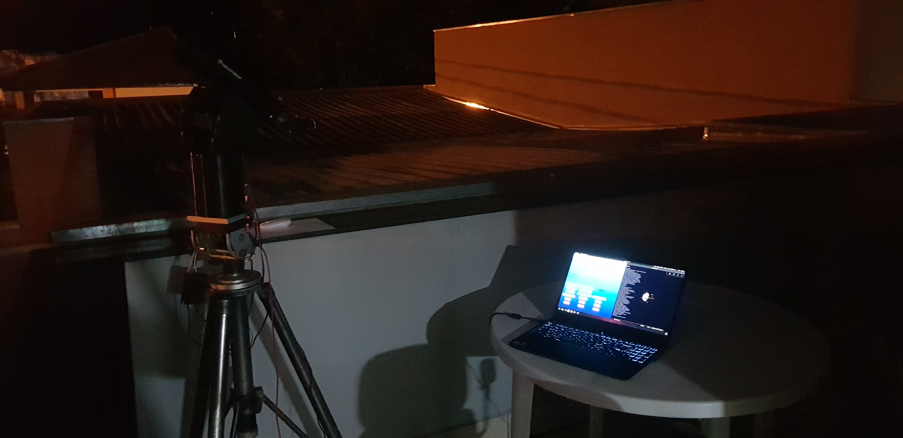
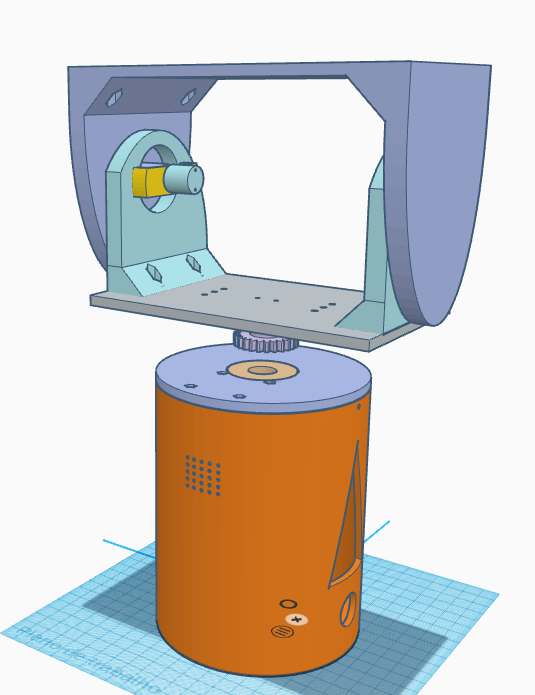
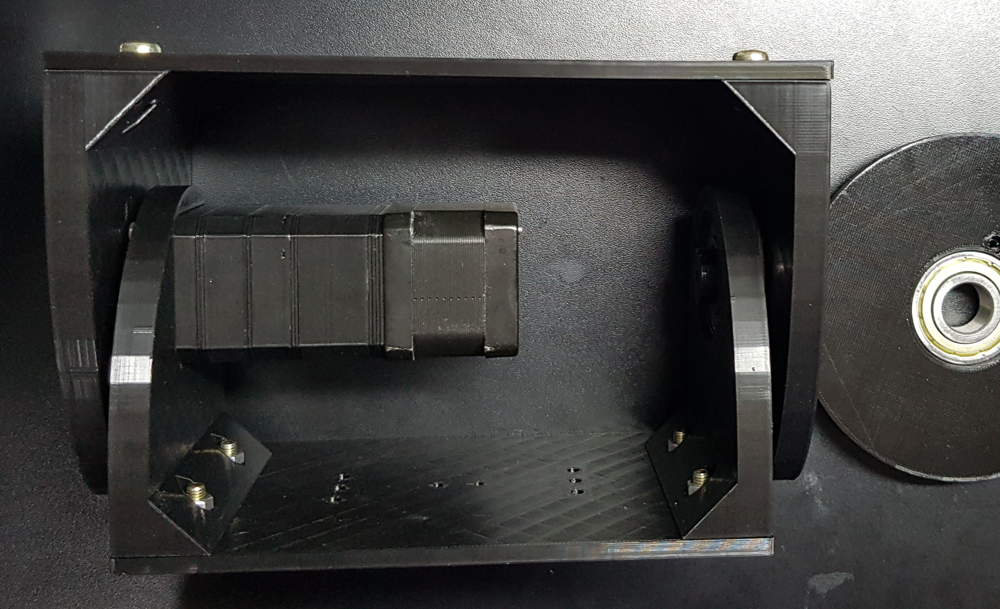
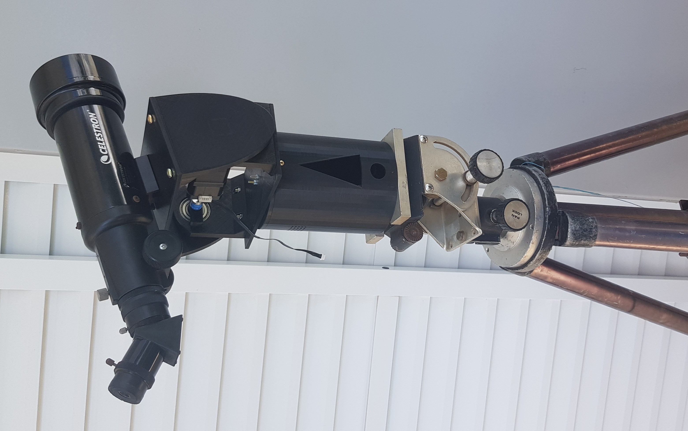
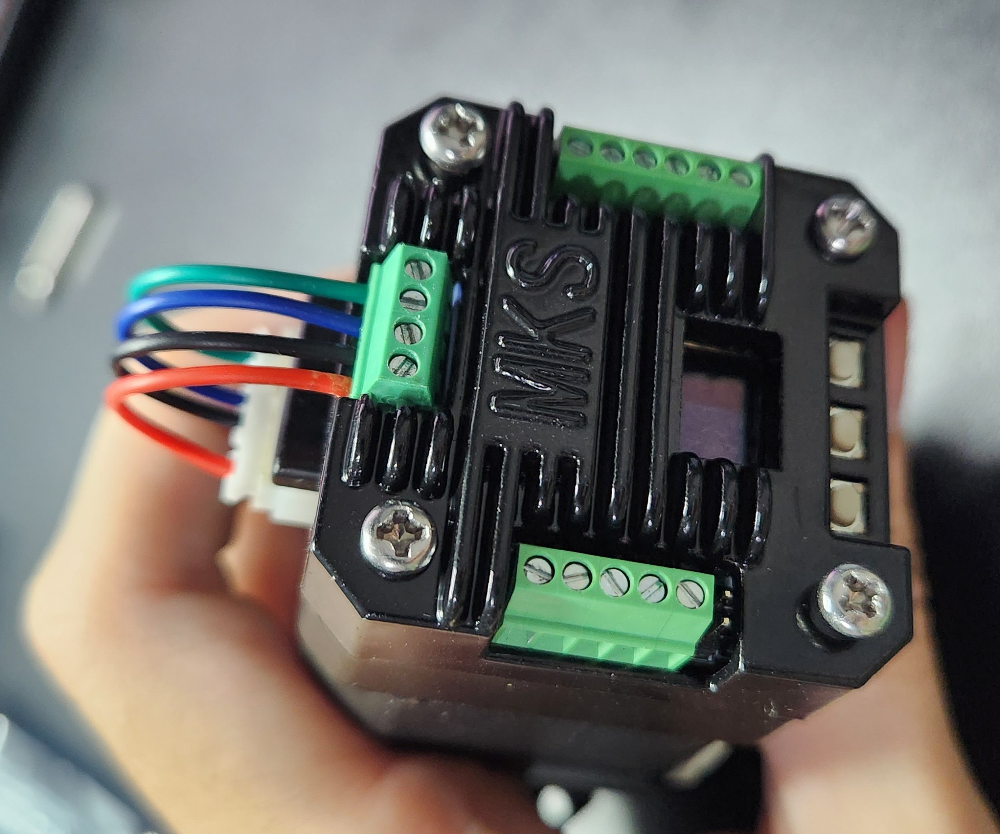

# Quem sou?
[Clique aqui](https://github.com/urbanze) para acessar meu perfil do GitHub. Informações de contato também estão presentes no perfil, caso queira conversar comigo, o Telegram é o jeito mais fácil e rápido =).

# O que é este site?
Este site conterá o detalhamento do desenvolvimento de alguns projetos pessoais, onde pretendo demonstrar o desenvolvimento, os problemas, as soluções, os erros e tudo que está envolvido ao desenvolver um projeto. A ideia é quase como um diário, onde estará relatado a evolução dos projetos ao longo do tempo, podendo ser útil para mais pessoas que queiram montar projetos similares.

Os projetos são apenas um desenvolvimento e desafio pessoal para melhorar minhas habilidades e fermentar meus hobbys. Todos projetos naturalmente conterão erros e muitos aspectos para melhorias, onde qualquer boa sugestão é sempre bem-vinda. DIY é o foco.

# GoTo Telescope

## O que é?
Um GoTo Telescope é basicamente um telescópio automatizado que podemos colocar as coordenadas dos objetos celestes (estrelas, planetas, etc) para que o software, motores e afins apontem ao objeto desejado. Também é comum que esses sistemas façam tracking (acompanham) do objeto em tempo real.

## Ideia inicial (12/2016)
A ideia de fazer esse projeto iniciou-se no fim do primeiro ano (2016) da minha faculdade, onde eu havia comprado um ESP8266-01 e estava procurando alguma coisa para automatizar, onde acabei olhando meu telescópio (Celestron 70mm Travel Scope) e decidi juntar as ideias sem mesmo saber que isso (GoTo Telescope) já existia e havias projetos difundidos pela internet.

## Controle
Desde bem pequeno, sempre utilizei o software Stellarium para visualizar o céu e acabei pensando em utilizar as coordenadas que aparecem na tela para indicar ao software de controle dos motores onde deve ser apontado. Após algumas pesquisas iniciais, descobri que o Stellarium havia um plugin para controle de telescópio e decidi estudar sobre o funcionamento e como seria essa comunicação com o telescópio utilizando o protocolo padrão "LX200".

## Primeira fase (2017)
Vale ficar claro que foi neste periodo, onde comecei a se interessar pela área de sistemas embarcados, programação e afins. Para qualquer coisa em que eu olhava era necessário estudar (muito!) para entender e conseguir aplicar. Tudo era novo e complicado para aprender, pois eu estava começando a faculdade e ainda não tinha nenhuma experiência profissional. Esse projeto que juntou um antigo hobby (astronomia) com um novo (sistemas embarcados) foi muito importante para minha vida profissional, onde consegui dar sentido aos estudos até chegar em um objetivo final (concluir o projeto) e por ser um projeto complexo, me abriu muitos caminhos com o tanto de conhecimento diversificado que precisei aprender para finaliza-lo.

### Primeiro protótipo alpha (01/2017)
Após semanas estudando o protocolo LX200 e como funcionaria para enviar os dados ao ESP8266 (via TCP e/ou Serial), iniciei os testes utilizando um Arduino Mega para converter as coordenadas enviadas pelo Stellarium para um único motor de passo do eixo X (Az). As fórmulas necessárias para toda conversão das coordenadas em formato RA/DEC para Alt/Az foram um verdadeiro desáfio complexo de ser vencido onde continuei com algumas partes sem solução, como o cálculo da hora ângulo baseado em minha coordenada: Local Sideral Time (LST). Com essa pedra no caminho, acabava colocando alguns valores fixos no código apenas para que as contas pudessem ser terminadas.

Os motores de passo escolhidos nesta etapa são os pequenos e baratos 28BYJ-48, vendidos em quase qualquer kit de Arduino. Já contam com uma redução interna e conseguem fazer um bom trabalho para os testes iniciais.

[Clique aqui](/videos/telescope_09012017.mp4) para visualizar o video do primeiro protótipo.

### Segundo protótipo alpha (02/2017)
Após um mês de desenvolvimento e melhorias, foi adicionado o motor do eixo Y (Alt) além de melhoria nas contas mas ainda sem sucesso em 100% das fórmulas, utilizando alguns valores fixos como a hora angulo para LST. A partir deste ponto, comecei a utilizar um laser verde de 1W bastante comum em astronomia no lugar do telescópio em si, pois é mais fácil para criar uma mecânica simples já que eu não tinha como criar sistemas grandes e robustos em casa.

### Terceiro protótipo alpha (07/2017)
Algums meses se passaram e com ajuda de um vizinho/amigo (Vitor) e sua CNC de corte a laser, consegui montar um prototipo de MDF mais digno de ser apresentado e funcional, com uma caixa nova, engrenagens e até uma pequena PCB com o circuito já adicionado ao ESP8266. Nestes meses também foi desenvolvido um software em C# para controle do telescópio pelo computador via TCP com o ESP8266. Este software permitia todos controles manuais e ainda havia a entrada para a variável da hora ângulo que até então ainda não consegui efetuar o cálculo dessa informação.

Este terceiro protótipo já conseguia fazer todas operações básicas da ideia inicial do projeto, mesmo que de forma relativamente precária. As engrenagens haviam bastante jogo (backlash, etc), os motores haviam pouquissima precisão e torque, já que eram pequenos, com pouca redução apenas para validar a ideia com o laser. O protótipo se mostrou funcional e conseguia mirar o laser para os objetos de forma visualmente satisfatória.

[Clique aqui](https://github.com/urbanze/urbanze.github.io/tree/main/videos/telescope_13072017.mp4) para visualizar o video do terceiro protótipo.

### Conclusão
Com este protótipo funcional, que validou a ideia inicial, o próximo passo será portar todo o sistema mecânico para um que suporte um telescópio em tamanho real. No caso, meu telescópio atual é um Celestron 70mm.

## Segunda fase (2021)
A segunda fase iniciou-se após alguns anos com o projeto parado, esta fase seria resposável por criar um mecânismo que consiga suportar o acoplamento de telescópios e, consequentemente, que contenha uma altíssima precisão e resolução para que mesmo com telescópios maiores (Ex: 8") consiga utilizar o mesmo sistema GoTo, então precisa ser muito bem feito, modelado e pensado!

Após inúmeras tentativas, ao longo de meses, de modelar um sistema mecânico em que seja possível acoplar vários tamanhos e formatos de telescópios, inclusive câmeras para astrofotografia, não obtive bons resultados durante a modelagem 3D (Tinkercad). A ideia por trás de fazer a mecânica para diversos tamanhos e tipos de telescópios é, para no futuro com o sucesso do projeto, comprar um telescópio de 8" para acopla-lo em meu sistema GoTo.

Com esses diversos testes estruturais, também desenvolvi um modelo 3D para o antigo projeto alpha com laser, onde tentei fazer minha primeira impressão 3D com a impressora de um amigo (Auro), porém, encontrei muitas dificuldades em fazer boas peças impressas, pois eu não entendia de todos detalhes relevantes para  uma boa impressão 3D. Segue a foto do modelo:

Durante meses tentei esquematizar a mecânica sem muito sucesso e encontrar meios de garantir a precisão do sistema por completo, onde acabei decidindo que aplicaria encoders absolutos diretamente no eixo X/Y do sistema, uma vez que isso me garantiria alta precisão independente da qualidade das engrenagens, backlash e afins. Diversas pesquisas na internet não me mostraram encoders absolutos com alta resolução e nem mesmo com preço baixo, então o projeto continua andando bem devagar.

Depois de quebrar muito a cabeça tentando "inventar" um sistema mecânico que suporte o telescópio completamente sozinho e não obter sucesso, visto que tenho pouquissimos conhecimentos em mecânica, decidi finalmente me inspirar com alguns sistemas que já existem no mundo, onde a melhor escolha pro meu sistema com suporte para multiplos telescópios será um Pan-Tilt convencional, muito utilizado em câmeras. A estrutura do Pan-Tilt é versátil pois além de movimentar ambos eixos, contém uma chapa lisa no topo, onde pode ser acoplado qualquer objeto, desde câmeras até telescópios ou lasers! A partir deste momento, meu sistema estava decidido em se tornar um Pan-Tilt, mas ainda há o problema em como montar um específico para meu projeto, que seja possível acoplar os motores de passo e encoders.

### Impressora 3D (12/2022)
Após meses tentando decifrar como montaria o pan-tilt em casa de forma barata e precisa, desisti das ideias de utilizar empresas tercerizadas para cortar MDF (como no projeto alpha) e acrílico, pois o tanto de peças e testes que eu precisaria fazer para validar todo o sistema ficaria muito caro e inviável. Após muitas pesquisas, decidi comprar uma impressora 3D para confeccionar o GoTo por completo e também todos meus outros futuros projetos, como um drone/aeromodelo. Com uma impressora inteiramente a minha disposição, poderia fazer milhares de testes quando houver necessidade de forma barata e com bastante precisão. Foi uma aquisição de extrema importância.

Com a impressora 3D em mãos, iniciei o desenvolvimento do modelo 3D do pan-tilt e também das engrenagens que seriam acopladas nos motores para aumentar precisão.

### Encoder absoluto
Depois de muitas pesquisas na internet, encontrei um encoder absoluto com alta resolução (18b) e preço muito baixo e super pequeno que iria viabilizar todo o novo projeto. Com esse carinha, conseguiria por em pratica todos novos e futuros objetivos. Com esse incrível encoder em mãos, teria certeza de que, independente dos motores e engrenagens perderem passos, alguem bater o braço ou até mesmo vento modificar a posição do telescópio, conseguiria saber a posição exata do sistema e efetuar correções para retornar na posição desejada. Sem esses encoders e depender unicamente dos motores e dezenas de engrenagens para saber a posição seria um desafio chato de ser vencido. Os encoders permitiram o projeto vingar!

Para que o sistema tenha exatidão na informação do encoder, obviamente eu não poderia colocar em qualquer lugar e muito menos conectado via engrenagens. Precisaria acopla-lo diretamente nos eixos do sistema para que qualquer pequeno movimento, mesmo que imperceptível aos olhos, seja detectado pelo encoder. Se utilizasse o encoder conectado com engrenagens teria o problema de folga entre os dentes e não poderia ter tanta certeza da posição correta onde o telescópio esta apontando.

### Motores e engrenagens
Agora que a brincadeira está mais séria, visto que preciso acoplar um telescópio de verdade e há necessidade de altissima resolução/precisão, nada mais justo que adicionar motores de passo Nema 17 com uma grande redução física para aumentar a resolução. Após uma longa análise de quais tipos de engrenagens ficariam boas, fáceis de montar e compactas, decidi optar pelas engrenagens planetárias que conseguem oferecer alta redução em pequeno espaço. Como criar conjunto de engrenagens que funcionem muito bem ainda é um desafio relativamente complexo para minhas skills de modelagem 3D, preferi encontrar algum modelo já pronto pela internet. Acabei encontrando uma planetária modular perfeita pro meu caso, que pode ser acoplada diretamente no eixo do motor, ficando compacto e até que bonito hehe. [Clique aqui](https://www.thingiverse.com/thing:2586962) para acessar o link do modelo.

Após algumas contas, cheguei a conclusão que uma redução de 256x seria a melhor escolha para manter uma boa velocidade e ainda boa precisão, visto que poderia aumentar a resolução via micropasso quando necessário. Mãos na massa então!

Para controlar os motores, escolhi o driver A4988 que oferece uma interface de controle via GPIO e pulsos. Utilizei uma PCB universal para soldar todos componentes de controle do motor. Após acoplar as engrenagens nos motores e fazer alguns testes, cheguei em algumas conclusões:
 - Funcionou para meu propósito que era aumentar a resolução do sistema, permitindo um controle mais fino ao telescópio.
 - Validou a ideia de ser compacto e ainda funcional.
 - Por causa da imperfeição da impressora 3D e tantas engrenagens, o conjunto de engrenagens faz um barulho relativamente alto e o conjunto inteiro se movimentava bem pouco conforme girava. Isso acontece provavelmente pois em alguns angulos, as engrenagens internas estarão mais para um lado forçando todo o conjunto mais para o lado e gerando enorme atrito. Após muitas horas de testes, notava também que a engrenagem acoplada no eixo do nema também ficou bem desgastada por causa do excesso de atrito e imperfeições (mesmo com uma generosa lubrificação).
 - A placa de controle contém os bornes para pulsos, controle de direção e controlar o micropasso (apenas 1x ou 16x).

Os sistema ao todo ficou com a seguinte resolução:
 - Nema 17: 200 Steps.
 - Planetária: 256x.
 - Micropasso: 1x ou 16x.
 - Total de passos para 1 volta: 51200 ou 819200.

Optei por 1x para focar em velocidade quando é necessário movimentar-se em grandes distâncias e 16x quando está próximo do objeto para ficar com mais precisão. Não coloquei mais micropassos pois o sistema ficou muito devagar e eu não gostava de ficar esperando durante os testes.

### Pan-Tilt v1 (01/2023)
Agora com os motores prontos para pleno funcionamento, é hora de partir ao modelo 3D do pan-tilt. Desenvolver esse modelo para que esteja tudo o mais perfeitamente correto, com o mínimo de erros e imperfeições será um desafio interessante, pois será meu primeiro modelo 3D "complexo" onde tudo precisa se encaixar com harmonia e exatidão. Levei algumas semanas para desenvolver toda a estrutura que deveria suportar os motores e ainda incluir os encoders diretamente nos eixos X/Y.

### Software
Com tudo encaixado, parti para criação da alma do projeto, o software. Este software que inicialmente pensei em desenvolver inteiramente dentro do ESP32 já que tenho vasta experiência, acabei decidindo fazer mais do que o ESP32 aguentaria. Decidi que esse projeto teria uma página web embarcada para total controle dos motores e também no futuro será responsável por mostrar ao vivo uma câmera acoplada no telescópio, assim permitirá o projeto ficar completamente wireless. Com essa ideia, ficou decidido de utilizar um Raspberry Pi (qualquer modelo) para controlar todos aspectos do telescópio, páginas webs e também uma ideia mirabolante... Pretendo utilizar processamento de imagem com OpenCV, que já tenho certa experiência, para fazer o ajuste fino de tracking e também gerenciamento de fotos para astrofografia com filtros em tempo real, etc. Possívelmente o suprassumo de um GoTo Telescope, que é utilizado em sistemas de grandissmo porte e eu desconheço algum projeto DIY utilizar tais coisas.

O software será construído em Node.JS pois é uma linguagem que adoro programar nos tempos livres (fácil, rápida e versátil). Todas comunicação com Stellarium, página web, controle dos motores, conversões matemáticas e afins ficarão gerenciadas pelo meu software em Node.JS, que farei tudo do mais absoluto zero. Por enquanto o software será responsável pela movimentação relativa e absoluta baseada nos encoders e também comunicação com o Stellarium.

Uma das partes mais legais de comunicar-se com o Stellarium tendo um Encoder, é que qualquer movimento é espelhado no icone de telescópio que é criado no Stellarium quando conecta-se em um. Isso funciona de forma incrível, pois ao habilitar o modo "telescópio (ocular view)" é possível ter a visão "identica" de como e para onde o telescópio está apontando, sem necessáriamente precisar do hardware em si. Isso facilita muito os testes e é legal de ver o feedback em ação.

### Primeiros testes
Finalmente anos depois da ideia inicial de colocar o telescópio para seguir estrelas, pode ser finalmente testada na prática. Primeiramente é preciso validar todo o controle relativo e absoluto dos motores juntamente com os encoders, já que virou um sistema fechado de alimentação (retroalimentação, feedback). Após isso é necessário confirmar se a comunicação com o Stellarium e todas conversões de RA/DEC para Alt/Az estão corretas e chegando até os motores.

[Clique aqui](videos/telescope_test_20230112.mp4) para ver o video da primeira movimentação do sistema com tudo acoplado.

Com os primeiros testes finalizados e a movimentação OK, é hora de testar em estrelas. 

Neste momento consegui coletar muitas informações importantes e valiosas ao projeto todo. Como agora é um caso real de aplicação, qualquer movimento/imprecisão será notada pois a estrela não estará centralizada, é fácil de saber se funciona ou não (mas não o motivo hehe).

 - Pro sistema funcionar, é preciso primeiramente fazer um passo de "calibração", em que consistiu de mandar (via Stellarium) o telescópio para uma estrela qualquer e depois manualmente efetuar a correção do movimento (sem que isso modifique os valores de coordenadas apontados pelo sistema). Após essa calibração primária, as coordenadas do sistema já batem com a estrela no visor do telescópio.
 - Os encoders realmente funcionam de forma maravilhosa, é muito legal de se ver! Simulei algumas batidas de mão e até ventos que fazia o sistema se movimentar e automaticamente, por causa dos encoders, o software detectava e retornava o telescópio para a estrela. Isso funcionou muito bem!
 - O eixo Y está perfeito com movimento suave e sem pulos.
 - O eixo X está com movimentação esquisita e grosseira, movimentando-se apenas após alguns graus de movimentação do motor. O movimento se dá em pulos grosseiros em vez de ser suave igual o Y. Isso me leva a crer que pode ser atrito, mas ainda será necessário estudar e testar mais.
 - A ponta da redução planetária feita em 3D contém um grande jogo (+-15 graus) e o sistema não contém nenhum tipo de atrito (intencional) e nem freio, logo, qualquer vento ou toque faz o sistema se movimentar. Mas isso é resolvido pelo feedback dos encoders. No futuro devo implementar algum tipo de freio eletronico ou algo do tipo.
 - Após fazer a calibragem em uma estrela e habilitar o tracking, o sistema manteve a estrela centralizada durante as 4h de teste.
 - O sistema não foi capaz de ir para outra estrela mesmo após a calibragem simples inicial. Isso ocorre provavelmente por desnível do sistema, visto que a movimentação não será mais linear. Por exemplo, se o pan-tilt estiver tombado para o lado, a movimentação deve ser diferente.
 - As engrenagens parecem não serem lineares e parecem adicionar dificuldade ao sistema de posicionamento.
 - A falta de limites mecânicos faz com que seja relativamente perigoso operar o sistema, já que algum comando errado ou falha no software pode fazer o pan-tilt bater no limite da estrutura e quebrar por inteiro. Acabei adicionando limitações "virtuais" utilizando a própria posição do encoder como fim-de-curso. Mas isso também está muito passível de falhas.

### Pan-Tilt v2 (02/2023)
Após esse primeiro sistema (v1) me mostrar que a ideia toda do projeto é válida e posso prosseguir em aperfeiçoar (milhões) de coisas, começei a pensar na solução de algum dos problemas citados anteriormente. Refiz a base do eixo X anterior que antes era apenas um cubo que alocava o encoder para uma espécie de "copo" que contém o motor e encoder X dentro de si. Também passei o motor Y que antes estava para fora do sistema para dentro, já que o motor X não ocupava mais este espaço. Também refiz boa parte dos encaixes para que caso alguma peça quebre (como aconteceu), possa facilmente imprimir uma nova e substituir. O primeiro projeto era quase tudo colado e ficava dificil/impossível manutenção. Então refiz todos encaixes com parafusos.

Com essas melhorias estruturais importantes, continuei fazendo mais testes reais em estrelas e tentando entender os problemas novos e os que continuavam:
 - Eixo X continuava dando pulos em vez de ser suave.
 - Ainda não conseguia mudar para outra estrela sem precisar calibrar manualmente. Após longas pesquisas, acabei lembrando que preciso fazer uma decomposição vetorial com a inclinação que deve ter no sistema, já que não está (e nunca estará) perfeitamente alinhado. Para fazer isso, pensei em fazer algum tipo de calibragem com multiplos pontos. Depois de mais algumas pesquisas encontrei que pessoal já utilizam um processo igual baseado em N estrelas para chegar nessa correção. Não sei o quão complexo será fazer isso mas chuto nível intermediário. Precisará ser implementado na próxima etapa.
 - A estrutura interna do motor X ficou bem ruim pela minha dificuldade de acoplar o encoder diretamente no eixo X ao mesmo tempo que o motor gira todo o sistema. Isso precisa ser refeito com toda certeza.

### Pan-Tilt v3 (10/2023)
Após alguns meses de pausa, estudos, testes simples e novas aquisições, a versão 3 do projeto está oficialmente a todo vapor. Ao longo de meses tentando entender o motivo do eixo X estar movimentando-se em pulos, finalmente cheguei em algumas ideias boas até com ajuda do ChatGPT (sim, tive que apelar) onde a causa dessa movimentação é excesso de atrito (sempre suspeitei). Para averiguar de fato se ocorre isso, adicionei algumas arruelas entre o eixo X e a base do copo para que a base do pan-tilt fique levemente "flutuando" e realmente resolveu o problema e o movimento tornou-se suave.

Com essas informações, tentei entender o que o pessoal utilizava para resolver excesso de atrito estático/dinâmico e o Teflon (PTFE) é sempre o mais indicado. Encontrei alguns na china e decidi comprar para testar.

Enquanto os Teflons não chegam, também decidi resolver outra coisa pendente de grande melhoria que seria as engrenagens planetárias. Apesar de terem servido bem ao propósito inicial, para o projeto avançar de forma bem estável e mais eficiente, decidi comprar engrenagens planetárias de metal e também um controlador para os motores de passo que são embutidos diretamente no motor (Controlador Makerbase MKS Servo42D RS-485).

#### Novas engrenagens e placas de controle
O conjunto de engrenagens e controle chegou e após alguns testes achei ambos absolutamente perfeitos. As engrenagens são extremamente robustas, com baixissimo backlash e jogo. A placa de controle é sensacional, pois além de ter encoder embutido, permite o controle via comandos serial de todo posicionamento, obtenção de status (posição, etc) e também tem embutido controle de aceleração/desaceleração, além de permitir encaixar sensores para fim-de-curso e outras features interessantes. Essa placa fica acoplada diretamente atras do motor e irei utilizar via Serial-RS485 com o Raspberry.

Esse novo conjunto deu outra cara pro projeto, que agora permite ser um sistema realmente robusto e estável. Com essa placa de controle, consegui obter velocidades tão altas que não acreditei quando vi. Até a ponta da redução estavá rápida mesmo com micropasso habilitado. Agora com todo esse novo conjunto de controle, é hora de refazer algumas partes do projeto!

Primeiramente, decidi manter por enquanto o código travado em micropasso de 64x (3276800 steps por volta), pois continua incrivelmente rápido e com muito mais resolução que antigamente, também penso em adicionar 256x (13107200 steps por volta) de micropasso no futuro já que a placa suporta. Também deixei uma acelaração nem baixa e nem alta para que o sistema fique estável e não de trancos na hora de iniciar ou parar o movimento. Com tudo isso em mãos e depois de diversos testes, notei que o sistema ficou incrívelmente estável e com facilidade de travar na posição desejada (posicionamento absoluto).

Acabei refazendo todo o software de controle dos motores, ficando infinitamente mais fácil que antes que utilizava controle por pulsos. Estou conseguindo utilizar o sistema com a precisão travada em 0.002 que os motores rapidamente, sem muito esforço, travam na posição desejada. Isso não acontecia tão facilmente com as engrenagens de plástico, levando dezenas de segundos para estabilizar nessa precisão. A brincadeira ficou séria.

Com esse sistema implementado, testei o feedback do motor e encoder fazendo com que o motor aponte exatamente para a posição do encoder. Este teste é apenas para demonstração da velocidade e feedback (e como ficou legal hehe).

[Clique aqui](videos/motor_feedback_20231121.mp4) para visualizar o teste do novo conjunto de controle e engrenagens dos motores.

Com todo o novo software já suportando esse controle mais inteligente e feito diversos testes em bacada com o posicionamento relativo e absoluto, estou pronto para voltar os testes nas estrelas assim que os pads de Teflon chegarem.

#### Pads de Teflon
Os pads de Teflon serão utilizados na base do pan-tilt em contato com o copo do motor para verificar se realmente funcionará e solucionará o problema de atrito. Validando o funcionamento do Teflon, iniciarei o desenvolvimento de uma nova base para o motor X, onde pretendo utilizar molas para reduzir ao máximo o jogo entre a engrenagem do motor e da base do pan-tilt. O motor e conder Y estão acoplados diretamente no pan-tilt, mas o eixo X só contém um lugar para acoplar ambos e por causa disso o motor X está conectado por uma engrenagem. Após a finalização desta nova base, iniciarei os próximos testes para validar a nova estrutura e controle. Se tudo ocorrer bem e a estrutura se mostrar robusta, iniciarei o desenvolvimento dos cálculos para movimentação por decomposição de vetores, que será baseado no alinhamento de N estrelas (provavelmente 3).
